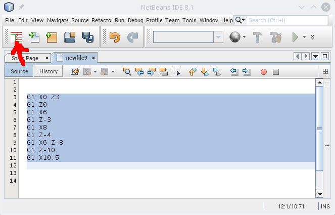

# GCodeRealign

A geometric constraint solver. It allows to define relationsships between the elements (lines and arcs) of a contour and solve it.

# Installation

* Download from: [http://plugins.netbeans.org/plugin/68344/](http://plugins.netbeans.org/plugin/68344/ )
* Go to "Tools" -> "Plugins" -> "Downloaded", click "Add Plugins..." and select the downloaded file org-roiderh-gcoderealign.nbm
* Check the Checkbox and click "Install"

# Usage

Select a pice of g-code which describes a contour. Click the Toolbar button.

Define the relationsships of the contour elements like fixed points and angles and click "calculate".
Click "ok" to replace selected contour by the new calculated contour.

