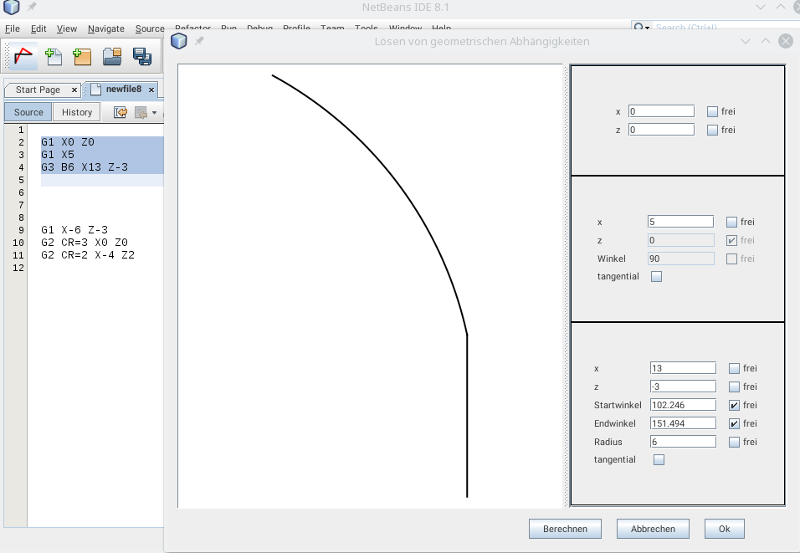
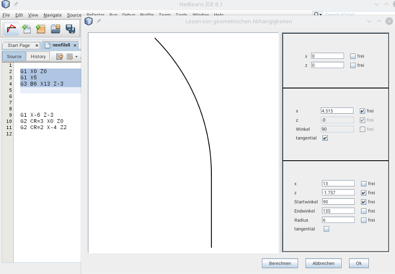

# GCodeRealign

A geometric constraint solver. It allows to define relationsships between the elements (lines and arcs) of a contour and solve it.
The solver use sketchsolve from:
[https://code.google.com/archive/p/sketchsolve/](https://code.google.com/archive/p/sketchsolve/)
The solver is a native library and is written in C++, it runs on Windows 7, Windows 10 and Linux.

# Installation

Require NetBeans 11, OpenJDK 11 and OpenJFX 12

## Prerequisites ##

netbeans.conf (etc/netbeans.conf):

- add to the netbeans_default_options (edit the path to javafx!):

        -J--module-path=<PATH TO javafx-sdk-12.0.1>/lib -J--add-modules=javafx.controls -J--add-exports=javafx.graphics/com.sun.javafx.sg.prism=ALL-UNNAMED  -J--add-exports=javafx.graphics/com.sun.javafx.scene=ALL-UNNAMED -J--add-exports=javafx.graphics/com.sun.javafx.util=ALL-UNNAMED -J--add-exports=javafx.base/com.sun.javafx.logging=ALL-UNNAMED -J--add-exports=javafx.graphics/com.sun.prism=ALL-UNNAMED -J--add-exports=javafx.graphics/com.sun.glass.ui=ALL-UNNAMED -J--add-exports=javafx.graphics/com.sun.javafx.geom.transform=ALL-UNNAMED -J--add-exports=javafx.graphics/com.sun.javafx.tk=ALL-UNNAMED -J--add-exports=javafx.graphics/com.sun.glass.utils=ALL-UNNAMED -J--add-exports=javafx.graphics/com.sun.javafx.font=ALL-UNNAMED -J--add-exports=javafx.graphics/com.sun.javafx.application=ALL-UNNAMED -J--add-exports=javafx.controls/com.sun.javafx.scene.control=ALL-UNNAMED -J--add-exports=javafx.graphics/com.sun.javafx.scene.input=ALL-UNNAMED -J--add-exports=javafx.graphics/com.sun.javafx.geom=ALL-UNNAMED -J--add-exports=javafx.graphics/com.sun.prism.paint=ALL-UNNAMED -J--add-exports=javafx.graphics/com.sun.scenario.effect=ALL-UNNAMED -J--add-exports=javafx.graphics/com.sun.javafx.text=ALL-UNNAMED  -J--add-exports=javafx.graphics/com.sun.javafx.embed=ALL-UNNAMED  -J--add-exports=javafx.graphics/com.sun.javafx.stage=ALL-UNNAMED  -J--add-exports=javafx.graphics/com.sun.javafx.cursor=ALL-UNNAMED

- at the end of the file: 

    for Linux:

        export LD_LIBRARY_PATH=<PATH TO javafx-sdk-12.0.1>/lib

    for Windows or set the PATH Variable in the System Settings or in etc/netbeans.conf:
        
        set PATH=%PATH%;<PATH TO javafx-sdk-12.0.1>/bin

## Install ##

* Download from: [http://plugins.netbeans.org/plugin/71602/](http://plugins.netbeans.org/plugin/71602/ )
* Go to "Tools" -> "Plugins" -> "Downloaded", click "Add Plugins..." and select the downloaded file org-roiderh-gcoderealign.nbm
* Check the Checkbox and click "Install"

# Usage

Select a pice of g-code which describes a contour. Click the Toolbar button .

Define the relationsships of the contour elements like fixed points and angles and click "calculate".
Click "ok" to replace selected contour by the new calculated contour.

click "ok" to replace the selected G-code with the new solved G-code.

